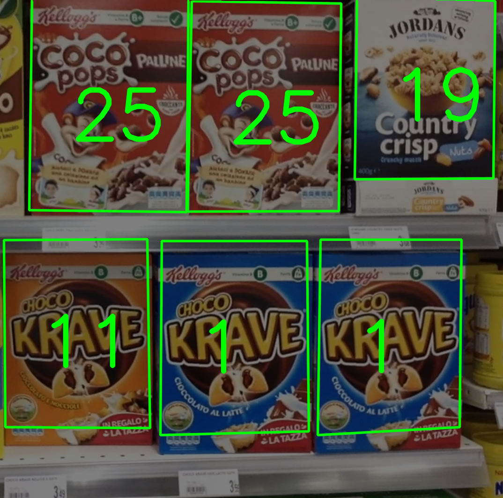

# product-recognition-on-store-shelves

The aim of this project is to develop a computer vision system that, given a reference image for each product, is able to identify boxes of cereals of different brands from one picture of a store shelf.

**Packages requirements**

`python version 3.5.10`

`jupyter version 1.0.0`  
`matplotlib version 3.0.3`  
`numpy version 1.18.5`  
`opencv-python version 3.4.2.16`  
`opencv-contrib-python version 3.4.2.16`  
`scikit-image version 0.15.0`
